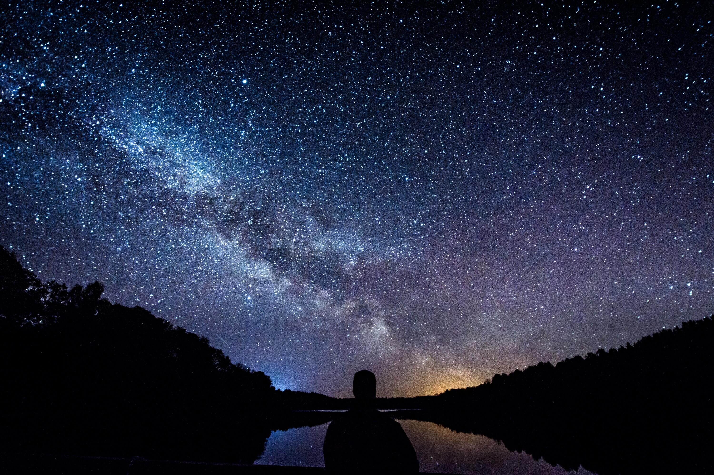

Stay, I said\
to the cut flowers.\
They bowed\
their heads lower.

Stay, I said to the spider,\
who fled.

Stay, leaf.\
It reddened,\
embarrassed for me and itself.

Stay, I said to my body.\
It sat as a dog does,\
obedient for a moment,\
soon starting to tremble.

Stay, to the earth\
of riverine valley meadows,\
of fossiled escarpments,\
of limestone and sandstone.\
It looked back\
with a changing expression, in silence.

Stay, I said to my loves.\
Each answered,\
*Always.*